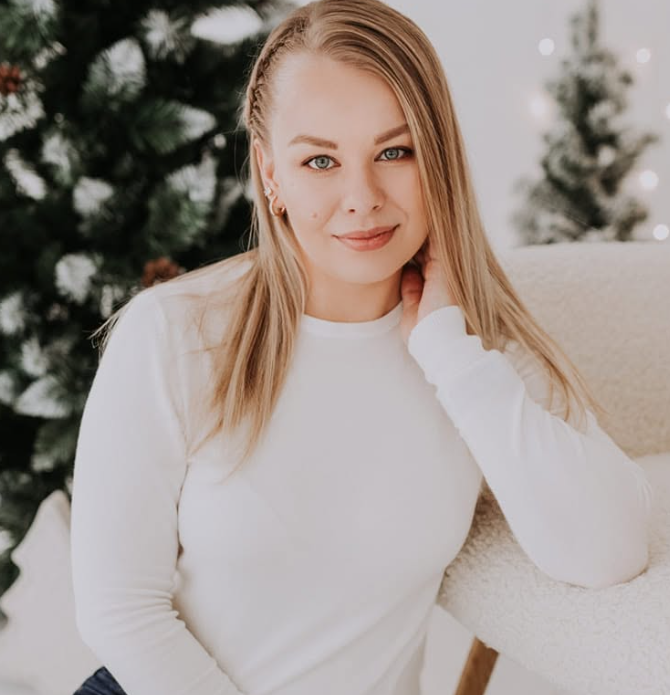

# Kätlin Tootmaa

## Minust

Olen Kätlin Tootmaa. Õpin hetkel Viljandi Kutseõppekeskuses noorem tarkvaraarendajaks. Mind huvitab andmeanalüüs ning mulle meeldib õppida uusi digioskusi. Uurin hea meelega andmeid, otsin neis seoseid ja esitan tulemusi arusaadavalt. Oma töid ja õpitut jagan andmeanalüütiku portfoolios.

## Minu huvid

- Andmeanalüüs
- Andmete visualiseerimine
- Uute digioskuste õppimine

## Minu portfoolio

[Minu andmeanalüütiku portfoolios](https://katlintootmaa-cmd.github.io/daca-portfolio/) saad tutvuda minu projektidega ja vaadata, mida olen õppimise käigus teinud.
